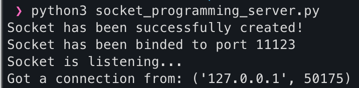
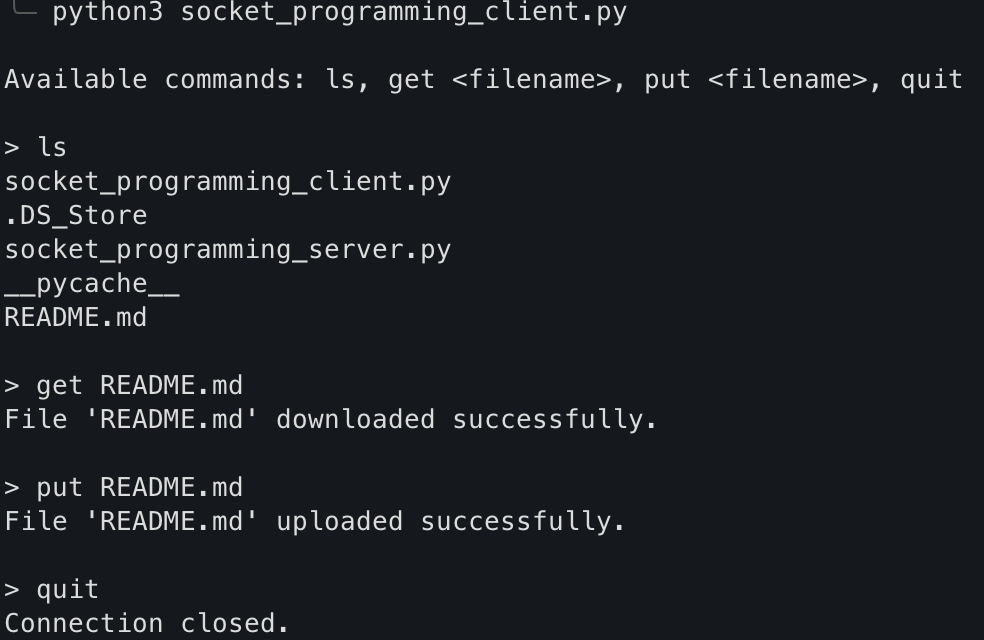

# Server and Client Local Socket Programming
## Group Members
1. Kush Bajaria (bajariakush@csu.fullerton.edu)
2. Joshua Yee (joshuayee@csu.fullerton.edu)
3. Randolph Brummett (rbrummett@csu.fullerton.edu)
4. Ric Escalante (rescalante12@csu.fullerton.edu)
5. Amir Valiulla (amir.valiulla@csu.fullerton.edu)

## Programming Language
- Python

## How to Execute
- Open two terminals and change the directory to where the files are located
- In one terminal, run the socket_programming_server.py file
- In the other terminal, run socket_programming_client.py

## Expected Results
- Expected server results: 
- Expected client results: 

## Remarks
- Congrats, if you have reached this far, you have sucessfully ran the local server and client sockets.